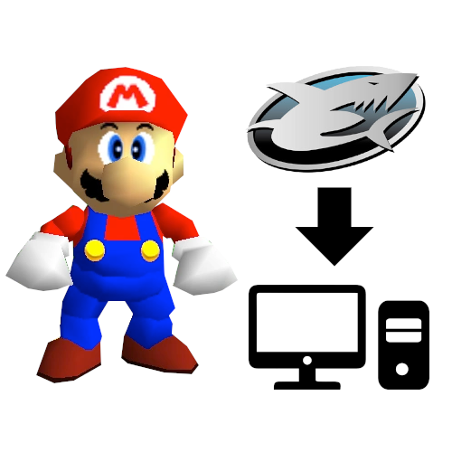

[](https://crates.io/crates/sm64gs2pc)
[](https://docs.rs/sm64gs2pc)
[](https://github.com/sm64gs2pc/sm64gs2pc/actions?query=workflow%3AChecks)
[](https://github.com/sm64gs2pc/sm64gs2pc/actions?query=workflow%3Acargo-audit)
[](https://coveralls.io/github/sm64gs2pc/sm64gs2pc?branch=master)

# sm64gs2pc



Convert Super Mario 64 GameShark codes to SM64 PC port patches

https://sm64gs2pc.github.io

## About

This tool converts GameShark cheat codes for Super Mario 64 into patches for PC
ports of Super Mario 64, such as
[sm64-port](https://github.com/sm64-port/sm64-port) and
[sm64ex](https://github.com/sm64pc/sm64ex). It's available as both a web app and
a command-line tool.

## Web app

A web app can be accessed at https://sm64gs2pc.github.io

### Compiling

To compile the sm64gs2pc web app yourself:
1. Install [wasm-pack](https://github.com/rustwasm/wasm-pack)
2. `cd sm64gs2pc-web`
3. `./build.sh`
4. The web app will be built in `static/`

## Command-line tool

### Installing

1. Install [Rust](https://rustup.rs/)
2. Run `cargo install sm64gs2pc`
     * On Unix, this installs to `~/.cargo/bin` by default

### Usage

```
sm64gs2pc --code <code> --name <name> > output.patch
```
* `--code <code>` - Path to file with GameShark code to convert
* `--name <name>` - Name of GameShark cheat

The output patch file can be applied to a PC port fork, but a
[base patch](base-patches) must be applied first.

## Limitations

Certain types of codes are unsupported

### Function patching

Codes that patch functions are unsupported, because compiler and CPU differences
make function patching infeasible. This is unlikely to ever be supported.

### GameShark button

Codes that use the GameShark (GS) button are unsupported, because it's not clear
which key it should be, and how it should be handled with the different PC port
forks. It's possible to add support after figuring this out, though.

### Read-only data patching

Certain data is read-only in the PC ports, and can't be modified at runtime. One
example is the player model, so color-changing hat codes unfortunately won't
work. Any declarations with `const` or `static` have this problem. This might be
possible to fix, but it's unclear how to get the memory addresses of these
declarations from the decompilation repo.

### Unknown code types

Some GameShark code types have unknown functionality, and it's almost impossible
to find any information on them. Even Nintendo 64 emulators don't support them.
One example is the `A4` code type. Basically, if a code is unsupported in
Mupen64Plus or Project64, sm64gs2pc definitely won't support it.
